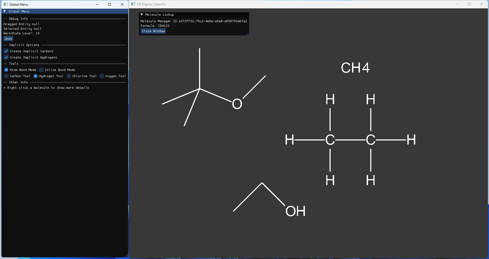

# MolGLide
_2D molecular drawing system_
___

MolGLide is a project I am writing to allow you to build organic molecules in a 2D editor.

It's currently a work in progress, and it will get things wrong. There will be bugs and weird errors.

It is built in Java and Kotlin (although I want to move from Java) using many utilities provided by the LWJGL. 

Chemical structure details are stored using CDK, and the 2D diagrams are stored using a custom scene graph. Rendering is provided by OpenGL.

This project uses the Ubuntu font, see data/chemvis/fonts/ for the full licence.

## Todo
- [ ] Sort out codebase (refactor, clean, rebuild some areas)
- [x] Primitive Carbon Skeleton Tool
- [ ] Better carbon skeleton tool