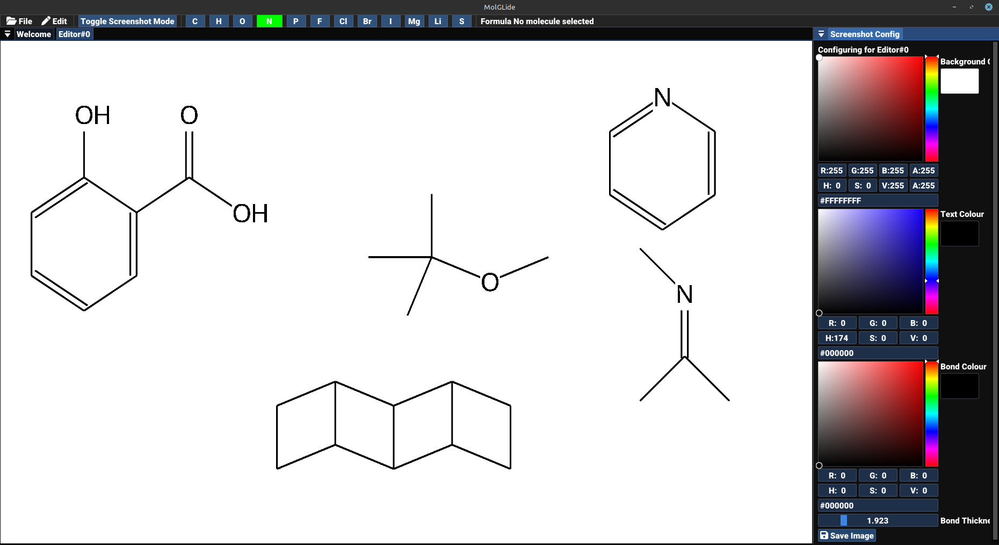

# MolGLide
_2D molecular drawing system_
___

> [!CAUTION]
> MolGLide currently exists as a prototype. It just about draws extremely simple molecules and is highly unstable.

[Download version 0.0.2](https://github.com/JCox06/MolGLide/releases/download/v0.0.2/MolGLide-0.0.2-UNIVERAL.zip) or alternatively [view the latest releases](https://github.com/JCox06/MolGLide/releases) 

MolGLide is a simple 2D molecular editor that I am working on.

It's currently a work in progress, and it will get things wrong. There will be bugs and weird errors.

Chemical structure details are stored using CDK, and the 2D diagrams are stored using a custom scene graph. Rendering is provided by OpenGL.

This project uses the Ubuntu font, see data/chemvis/fonts/ for the full licence.

Screen shot mode:

## Building and Running
All the building issues have now been fixed. Maven should now import the project and be able to build it. To run the project make sure you have Java 21 installed.

## Todo
- Rewrite the scene graph and component system. I still need to decide how the new system should be designed and how it should work. But the current system needs an urgent rewrite
- Fix bugs when taking screenshots (lots of bugs here)
- Refactor code and make it clearer to read because right now the code is terrible!

## More screenshots
The following is a screenshot I have taken using screenshot mode, saved with the background removed (Alpha channel set to 0):
