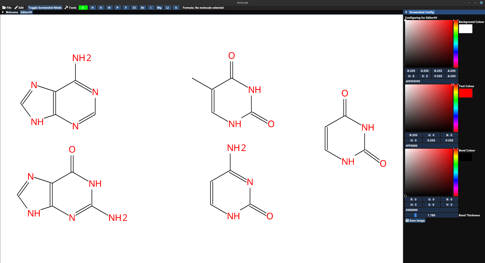

# MolGLide
_2D molecular drawing system_
___

Development will resume in one week. 

> [!CAUTION]
> MolGLide currently exists as a prototype. It just about draws extremely simple molecules and is highly unstable.

[Download the latest version here](https://github.com/JCox06/MolGLide/releases) 

MolGLide is a simple 2D molecular editor that I am working on.  It's currently a work in progress, and it will get things wrong. There will be bugs and weird errors.

Chemical structure details are stored using CDK, and the 2D diagrams are stored using a custom scene graph. Rendering is provided by OpenGL.

This project uses the Ubuntu font, see data/chemvis/fonts/ for the full licence.

Screenshot mode:

_It is then possible to save the image above with options to remove the background_

## Building
All the building issues have now been fixed. Maven should now import the project and be able to build it. To run the project make sure you have Java 23 installed.
1) Install the latest JDK
2) Install Maven build tool (or use a Java IDE)
3) Run the commands below in the project directory, or use the bult in tools in your IDE
4) `mvn clean`
5) `mvn package`
6) Now you should have a .jar archive produced in the target directory. 
7) Run the jar with `java -jar filename.jar`

_Note that only Windows AMD64 and Linux AMD64 are currently supported_

## Running
1) Install a JDK 23 (although I have been testing on 17)
2) Download MolGLide from the releases section on this page 
3) Extract the archive and run the program (jar file) by double-clicking or using the command line

## Todo
- Rewrite the scene graph and component system. I still need to decide how the new system should be designed and how it should work. But the current system needs an urgent rewrite
- Fix bugs when taking screenshots (lots of bugs here)
- Refactor code and make it clearer to read because right now the code is terrible!
