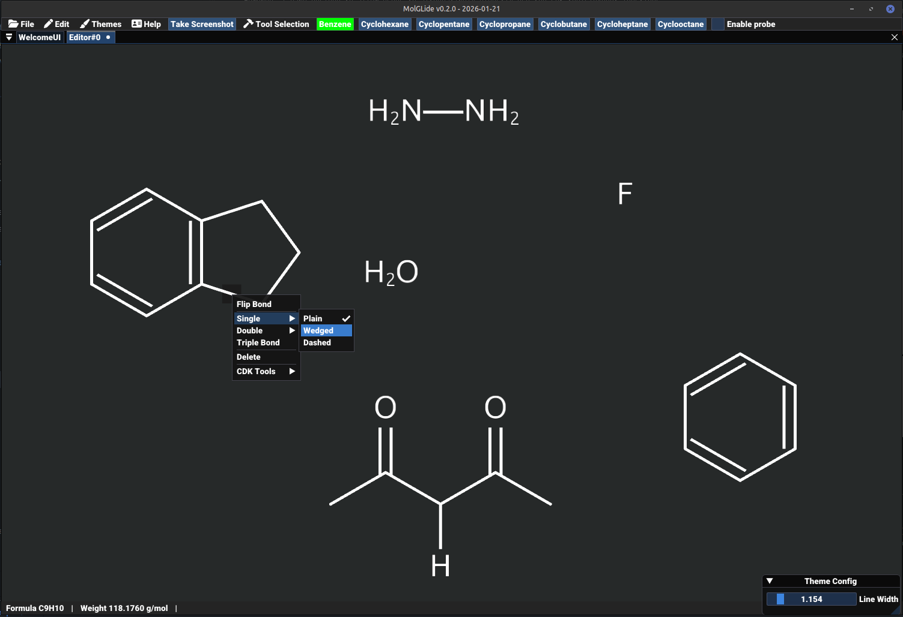

# MolGLide (v0.2.0 - ALPHA)
**MolGLide is an open source simple molecular editor. You can draw simple molecules, and export them _for free_ to png image files.**

>MolGLide is alpha software and is unstable!

MolGLide is a molecular editor or sketcher, written in OpenGL. It is powered by, and interfaces directly with the CDK (Chemistry Development kit). 
It's a fun little project, that while doesn't have an end goal, I would like to create an actually useful piece of software. See the checklist!

-  [x] Create basic molecules by connecting atoms through bonds
-  [x] Create molecules from common templates (Benzene, Other Rings)
-  [x] Save and load your project using MolGLide's custom file format: MolGLide graph file (.mgf)
-  [x] High performance OpenGL foundation with Batch Rendering and Instanced Rendering
-  [ ] Fusing rings and other templates to existing molecules through a custom bond
-  [x] Basic Molecule Manipulation
-  [x] CDK SVG molecule exports
-  [x] Custom PNG Image export*
-  [ ] Custom SVG export*
-  [ ] Custom group insertion (Editing a label of an atom and changing it to something like CH2CH3)
-  [x] Molecular Formula and Molecular Weight calculation
-  [ ] Exporting molecules to other sketcher software
-  [ ] Reaction Arrows, Curly Arrows, Custom Text boxes

\* The reason for needing writing a custom SVG/PNG export is so it remains consistent with the OpenGL rendering system - And 
so it supports extra level information that you would expect from a molecular editor/sketcher that the CDK doesn't support. 
However, I have decided to allow users to alternatively directly use the CDK tools/export functions.

**_Please scroll down to see some screenshots of the editor and the png files the program can produce_**

[Download the latest version here](https://github.com/JCox06/MolGLide/releases) 

If you need any help, there is a [tutorial.md](tutorial.md) webpage.

## Screenshots

## Building
To build the project make sure you have Java 23 installed.
1) Install the latest JDK
2) Install Maven build tool (or use a Java IDE)
3) Run the commands below in the project directory, or use the bult in tools in your IDE
4) `mvn clean`
5) `mvn package`
6) Now you should have a .jar archive produced in the target directory. 
7) Run the jar with `java -jar filename.jar`

_Note that only Windows AMD64 and Linux AMD64 are currently supported_

## Running
1) Install a JDK 23 (although I have been testing on 17)
2) Download MolGLide from the releases section on this page 
3) Extract the archive and run the program (jar file) by double-clicking or using the command line

## Technology Used:
- Ubuntu Font, see data/chemvis/fonts/ for the full licence.
- Kotlin
- [LWJGL (OpenGL, GLFW, STB)](https://www.lwjgl.org/)
- [JOML](https://github.com/JOML-CI/JOML)
- [Imgui-Java](https://github.com/SpaiR/imgui-java)
- [Chemistry Development Kit](https://cdk.github.io/)
- [tinylog](https://tinylog.org/)
