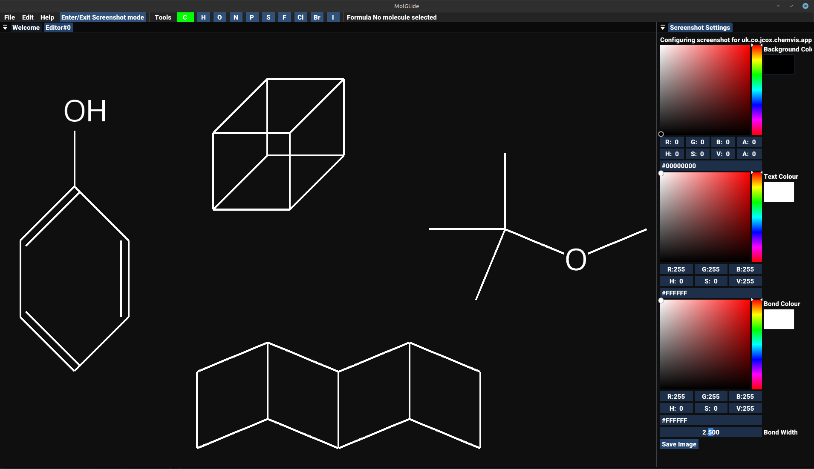
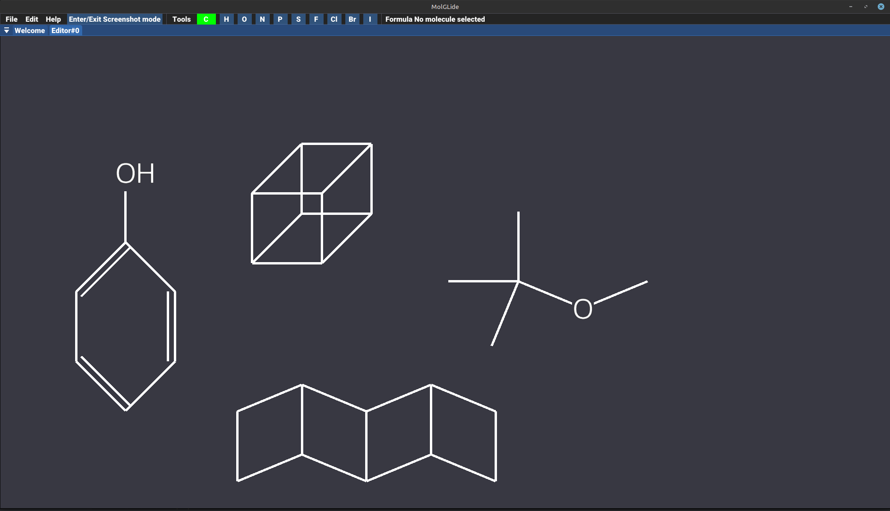

# MolGLide
_2D molecular drawing system_
___

> [!CAUTION]
> MolGLide currently exists as a prototype. It just about draws extremely simple molecules and is highly unstable.

[Download the latest version](https://github.com/JCox06/MolGLide/releases/download/v0.0.1/MolGLide-UNIVERSAL-0.0.1.zip)

MolGLide is a project I am writing to allow you to build organic molecules in a 2D editor.

It's currently a work in progress, and it will get things wrong. There will be bugs and weird errors.

It is built in Java and Kotlin (although I want to move from Java) using many utilities provided by the LWJGL. 

Chemical structure details are stored using CDK, and the 2D diagrams are stored using a custom scene graph. Rendering is provided by OpenGL.

This project uses the Ubuntu font, see data/chemvis/fonts/ for the full licence.

Screen shot mode:

## Building
All the building issues have now been fixed. Maven should now import the project and be able to build it. 

## Todo
- Rewrite the scene graph and component system. I still need to decide how the new system should be designed and how it should work. But the current system needs an urgent rewrite
- Fix bugs when taking screenshots (lots of bugs here)
- Refactor code and make it clearer to read because right now the code is terrible!

## More screenshots
The following is a screenshot I have taken using screenshot mode. There are also options to remove the background

The editor
