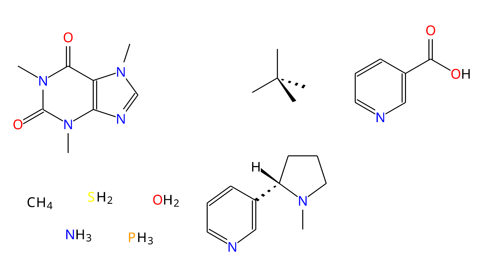

# MolGLide (v0.1.0 - ALPHA)
**MolGLide is an open source simple molecular editor. You can draw simple molecules, and export them _for free_ to png image files.**

The application is intended for easy, simple and experimental use, for instance, drawing molecules to be used in lab write-ups and other non/semi-professional work.

Despite being _alpha_ software, MolGLide is able to draw simple molecules and supports:
- An array of commonly used atoms (C, H, O, N, P, F, Cl, Br, I, Mg, Li, S)
- Automatically determines the number of implicit hydrogens each atom should have in a molecule
- Automatically determines the molecular formula of a molecule's sketch
- Supports single and double bonds
- Supports stereochemistry bonds
- Exporting molecules as png image files (These can then be copied into applications like Word or Libre Office)
- Undo and Redo support
- [COMING SOON] Insert commonly used molecules as templates

**_Please scroll down to see some screenshots of the editor and the png files the program can produce_**

[Download the latest version here](https://github.com/JCox06/MolGLide/releases) 

If you need any help, there is a [tutorial.md](tutorial.md) webpage.

## Screenshots

|   |   |
|---|---|
|||

## Building
To build the project make sure you have Java 23 installed.
1) Install the latest JDK
2) Install Maven build tool (or use a Java IDE)
3) Run the commands below in the project directory, or use the bult in tools in your IDE
4) `mvn clean`
5) `mvn package`
6) Now you should have a .jar archive produced in the target directory. 
7) Run the jar with `java -jar filename.jar`

_Note that only Windows AMD64 and Linux AMD64 are currently supported_

## Running
1) Install a JDK 23 (although I have been testing on 17)
2) Download MolGLide from the releases section on this page 
3) Extract the archive and run the program (jar file) by double-clicking or using the command line

## Technology Used:
- Ubuntu Font, see data/chemvis/fonts/ for the full licence.
- Kotlin
- [LWJGL (OpenGL, GLFW, STB)](https://www.lwjgl.org/)
- [JOML](https://github.com/JOML-CI/JOML)
- [Imgui-Java](https://github.com/SpaiR/imgui-java)
- [Chemistry Development Kit](https://cdk.github.io/)
- [tinylog](https://tinylog.org/)
