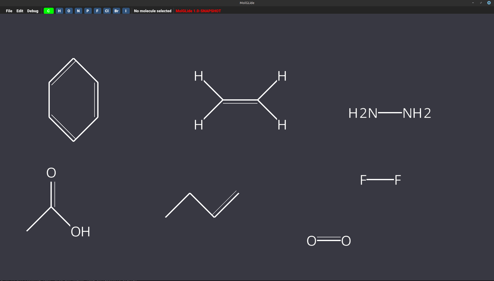

# MolGLide
_2D molecular drawing system_
___

> [!CAUTION]
> MolGLide currently exists as a prototype. It just about draws extremely simple molecules.

MolGLide is a project I am writing to allow you to build organic molecules in a 2D editor.

It's currently a work in progress, and it will get things wrong. There will be bugs and weird errors.

It is built in Java and Kotlin (although I want to move from Java) using many utilities provided by the LWJGL. 

Chemical structure details are stored using CDK, and the 2D diagrams are stored using a custom scene graph. Rendering is provided by OpenGL.

This project uses the Ubuntu font, see data/chemvis/fonts/ for the full licence.

## Building
This is a bit weird. Maven will error if you try to build the project initially. First run the main class in IntelliJ, and then if you want package in Maven. This is because I have some old Java files in the project and the Maven Compiler Plugin will error out. I plan on converting these to Kotlin at some point. 

## Todo
- [ ] Re-write CDKManager and IMoleculeManager in Kotlin 
- [ ] Fix and properly centre Text Rendering
- [ ] Elemental Label editing (Clicking on an atom where you can swap it for another element, or for Me, Et, Ph groups)
- [ ] Structure Templates (Benzene, other rings)
- [ ] Snap to vertex (maybe will add this?) 
- [ ] Diagonal bonds shorter than standard bonds to allow for cyclopropane looking nice and other weird rings
- [x] Primitive Carbon Skeleton Tool
- [x] Better carbon skeleton tool
- [x] Sort out codebase (refactor, clean, rebuild some areas)
