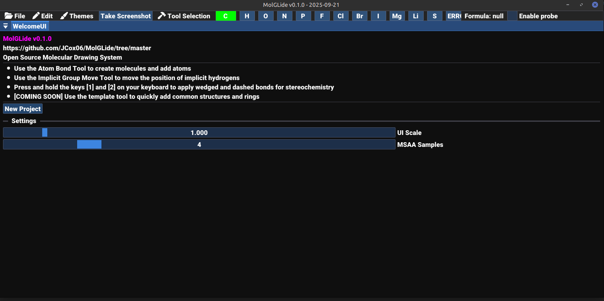
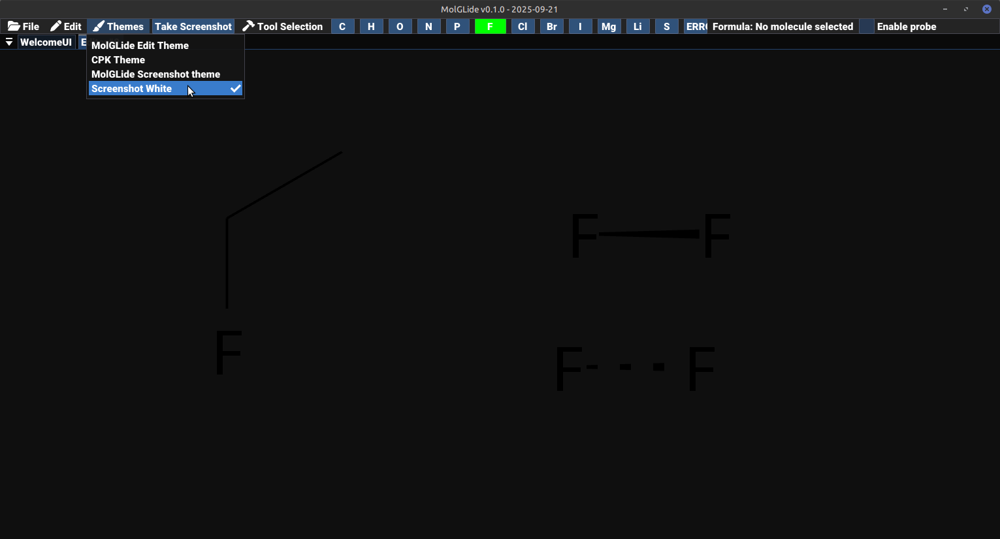

# MolGLide Mini Tutorial

## Creating a new project
When first opening MolGLide, you are brought to the WelcomeUI. This screen allows you to modify the GUI scale and the MSAA antialiasing samples.

| Setting      | Meaning                                                                                                          |
|--------------|------------------------------------------------------------------------------------------------------------------|
| GUI Scale    | Changes how big the UI and text is. The default is 1                                                             |
| MSAA Samples | A higher antialiasing value increase graphics quality, but not all computers will support the same maximum value |

To begin a project click the "New Project" button, or click File -> New Project

This will take you to an editor tab

## Creating a molecule 

The editor tab is the core functionality of MolGLide. This allows you to create and draw molecules. Create fluoroethane by:
1) Pressing C (for carbon) at the main menu bar (it will already be selected)
2) Then left click anywhere in the main empty space to place the carbon. (The Implicit hydrogen count of 4 will be calculated automatically)
3) Click and drag from methane to place another carbon. A bond will automatically be created, and a new implicit hydrogen count will be calculated on both carbons.
4) Select F at the main menu bar and then click and drag from one of the carbons 

## Placing wedged and dashed bonds
By default, all bonds that are placed are in-line with the plane/screen. To place a bond that is facing the viewer (a wedge) or a bond that is facing into the paper (a dash) you can:
- Press and hold [1] and then click and drag to insert a wedge
- Press and hold [2] and then click and drag to insert a dash

## Placing double bonds
To place a double bond first place a single bond, and then click and drag as if you were adding a second single bond, but overlay this where the single bond was. A double bond should now have been inserted.

## Themes and Screenshots
MolGLide uses theme to change the background colour, element colour, bond colour, and bond thickness. There are two types of themes included:

| Theme Type        | Explanation                                                                                                                                |
|-------------------|--------------------------------------------------------------------------------------------------------------------------------------------|
| Normal Themes     | These themes supply a background colour                                                                                                    |
| Screenshot themes | These themes supply a transparent background colour. They are perfect for exporting your molecules as a png file for use in other programs |

To change your theme, go to the main menu bar the click Themes, and then click the theme you want to apply.

Then click the button in the main menu bar "Take Screenshot" to save your screenshot

The following images below give an example of choosing a theme and then saving a screenshot

**NOTE:**  Images are saved in `~/Pictures/MolGLide`

As an example of the transparent background colour, you may notice the background colour of the screenshot is actually provided by your Github theme.

|                                                                   |                                                                            |
|-------------------------------------------------------------------|----------------------------------------------------------------------------|
|  |  |
